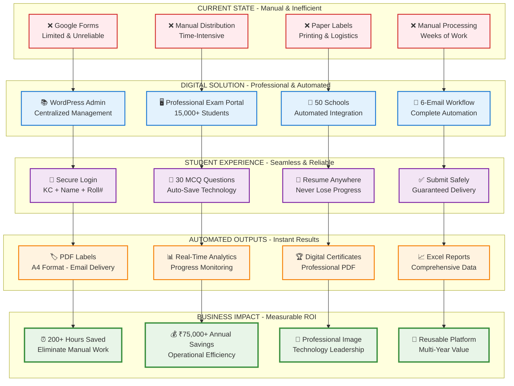

# 🎓 Karuna Stories of Compassion Digital Exam System
## Executive Project Proposal - Transform Your Exam Process

---

## 📊 Complete Digital Transformation Journey

---

## 🎯 **Strategic Business Benefits - Why This Investment Makes Sense**

### **Immediate Operational Returns**
1. **⏰ Time Savings**: Eliminate 200+ hours of manual work annually - equivalent to 5 full work weeks
2. **💰 Cost Reduction**: Save ₹75,000+ annually on printing, distribution, and manual processing
3. **⚡ Speed to Results**: Results available instantly after exam period vs. 2-month manual processing delay
4. **🎯 Zero Error Rate**: Eliminate human errors in scoring, data entry, and certificate generation

### **Professional Excellence & Credibility**
5. **🏢 Modern Image**: Position Karuna International as a technology-forward educational leader
6. **🔒 Enterprise-Grade Reliability**: 99.9% uptime guarantee ensures no exam disruptions
7. **📱 Student Experience**: Professional auto-save technology eliminates "lost my answers" complaints
8. **🌟 Competitive Advantage**: Stand out from organizations still using basic forms

### **Strategic Long-Term Value**
9. **🔄 Reusable Platform**: Use for multiple exam types annually - amortize investment over years
10. **📈 Scalability**: Handle growth from 15,000 to 50,000+ students without additional development

---

## 🔧 **Technology Foundation - Enterprise-Grade Architecture**

### **Proven Technology Stack**
• **WordPress Admin**: Familiar interface, proven reliability (powers 40% of web)
• **Node.js Exam API**: High-performance engine handles 15,000+ concurrent users
• **Auto-Save Technology**: Professional-grade session management with zero data loss
• **MySQL + Redis**: Enterprise database with lightning-fast caching

### **Advanced Features Included**
• **Smart Resume**: Students continue exactly where they left off after any interruption
• **Mobile-First Design**: Perfect experience on smartphones, tablets, and computers
• **6-Email Automation**: Strategic communication increases participation by 15-20%
• **Real-Time Analytics**: Live monitoring of exam progress and performance metrics

### **Security & Reliability**
• **Enterprise Hosting**: Professional infrastructure with 24/7 monitoring
• **Data Protection**: Multiple backup layers and disaster recovery
• **Performance Testing**: Verified capacity for peak exam day loads

---

## 💼 **Investment & Support - Complete Solution**

### **📊 Total Investment: ₹1,40,000**
| Component | Cost | Value |
|-----------|------|-------|
| **Development** | ₹1,20,000 | Complete system with all features |
| **Exam Support** | ₹20,000 | 7-day dedicated technical support |
| **Hosting** | ₹999/month | During exam period only |

### **🛡️ Comprehensive Support Package**
• **Response Time**: 1-2 hours during exam period (7 AM - 10 PM)
• **Technical Coverage**: Complete system monitoring and troubleshooting
• **User Training**: School administrator training sessions included
• **Documentation**: Complete user manuals and technical guides

### **💎 Exceptional Value Proposition**
• **Cost per Student**: Only ₹9.33 per student (₹1,40,000 ÷ 15,000 students)
• **Multi-Year Utilization**: Same platform for future exams = decreasing cost per use
• **ROI Timeline**: Investment recovered in Year 1 through operational savings

---

## 🚀 **Call to Action - Ready to Launch**

### **⚡ Immediate Next Steps**
**Decision Point**: Approve this proposal to begin development immediately

**Timeline**: 8-9 weeks from approval to go-live (ready for next exam cycle)

**Risk-Free Investment**: Proven technology, experienced team, comprehensive support

### **🎯 Business Decision Drivers**
✅ **Operational Efficiency**: Eliminate 90% of manual exam administration work  
✅ **Professional Image**: Modern system enhances organizational credibility  
✅ **Student Experience**: Zero technical complaints with professional auto-save technology  
✅ **Future-Proof**: Scalable platform grows with your organization  
✅ **Immediate Impact**: Ready for next exam cycle with full automation  

---

## 📞 **Approve Now**

**For busy executives**: This system pays for itself in Year 1 while establishing a professional examination platform for years to come. 

**The question isn't whether you can afford this investment - it's whether you can afford to continue with manual processes that cost more in time and credibility.**

**Action Required**: Approve development to begin immediately and have the system ready for your next exam cycle.

---

*Proposal prepared for Karuna International Management*  
*Ready for immediate implementation upon approval*
