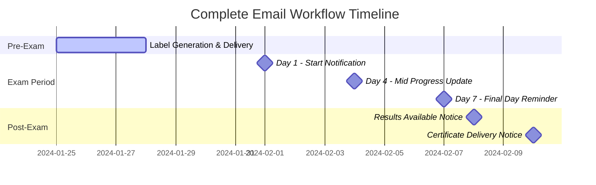
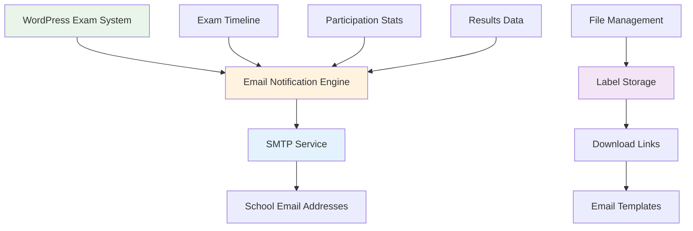

# Complete Email Workflow Solution
## Karuna Stories of Compassion Exam System

---

## Executive Summary

This document outlines a comprehensive, cost-effective email workflow solution for the Karuna Stories of Compassion Exam System. The solution covers the complete communication cycle from pre-exam label delivery to post-exam notifications, specifically designed for short-duration usage during the exam period.

**Key Points:**
- **5-6 emails total** per exam period (1 label delivery + 3 exam notifications + 1-2 post-exam)
- **50 schools maximum** as recipients
- **Students receive NO emails** - all communication goes to schools only
- **Cost-optimized** for short-duration usage
- **File hosting strategy** for label delivery

---

## Complete Email Workflow Timeline

### Pre-Exam Phase (1-2 weeks before exam)



### Email Sequence Overview

1. **Email 1**: Label Delivery (1-2 weeks before exam)
2. **Email 2**: Exam Start Notification (Day 1)
3. **Email 3**: Mid-Exam Progress Update (Day 4)
4. **Email 4**: Final Day Reminder (Day 7)
5. **Email 5**: Results Available Notice (Day 8)
6. **Email 6**: Certificate Delivery Notice (Day 10)

---

## Email 1: Label Delivery System

### File Hosting Strategy

#### **Option 1: WordPress Hosting (Recommended)**
- **Cost**: ₹0 additional (uses existing hosting)
- **Storage**: Labels stored in WordPress media library
- **Access**: Direct download links sent via email
- **Security**: Password-protected or time-limited access
- **Advantages**: No additional costs, integrated with system

#### **Option 2: Google Drive Integration**
- **Cost**: ₹0 (free tier sufficient)
- **Storage**: Labels uploaded to Google Drive
- **Access**: Shared links with school-specific access
- **Security**: School-specific sharing permissions
- **Advantages**: Familiar interface, reliable access

#### **Option 3: Dedicated File Hosting**
- **Cost**: ₹500-1,000/month (only during exam period)
- **Storage**: Professional file hosting service
- **Access**: Custom download portal
- **Security**: Advanced access controls
- **Advantages**: Professional appearance, detailed analytics

### Label Delivery Email Template

**Subject Line:** 📋 Karuna Exam Labels Ready - Download Instructions

```
Dear [School Name] Administrator,

Your student login labels for the Karuna Stories of Compassion Exam are ready for download!

📊 Your School Details:
- School Name: [School Name]
- Total Students: [X] students
- Label File: [School Name]_Labels_2024.pdf
- File Size: [X] MB

🔗 Download Instructions:
1. Click the secure download link below
2. Save the PDF file to your computer
3. Print the labels on A4 paper (16 labels per sheet)
4. Cut along the dotted lines
5. Distribute to students before exam period

📥 Download Link:
[Secure Download Link - Valid for 30 days]

📋 Label Contents:
- Student Name
- KC Number
- Roll Number
- Exam Portal URL
- QR Code for easy access

⚠️ Important Notes:
- Download link expires in 30 days
- Each label is unique to one student
- Do not share labels between students
- Contact support if you need assistance

📞 Support Contact:
- Email: support@karunainternational.org
- Phone: [Phone Number]
- WhatsApp: [WhatsApp Number]

📅 Next Steps:
- Exam window opens: February 1, 2024
- You will receive exam start notification on Day 1
- Monitor student participation through admin dashboard

Best regards,
Karuna International Team
```

---

## Email 2-4: Exam Period Notifications

### Email 2: Exam Start Notification (Day 1)

**Subject Line:** 🎯 Exam Window Now Open - [X] Students Ready to Participate

```
Dear [School Name] Administrator,

The Karuna Stories of Compassion Exam window is now OPEN!

📊 Your School Status:
- Total Registered Students: [X]
- Students Ready to Take Exam: [X]
- Exam Period: February 1-7, 2024 (7 days)

🌐 Exam Portal: karunainternational.org/exam

📋 Action Items:
1. Ensure all students have received their login labels
2. Encourage students to take the exam early
3. Monitor participation through your admin dashboard

📈 Participation Tracking:
- Real-time completion statistics available
- You will receive progress updates on Day 4 and Day 7
- Support available throughout the exam period

🔗 Quick Links:
- Student Portal: [Link]
- Admin Dashboard: [Link]
- Support: [Contact Info]

Good luck to all your students!
Karuna International Team
```

### Email 3: Mid-Exam Progress Update (Day 4)

**Subject Line:** 📊 Progress Update: [X] Completed, [Y] Remaining - 3 Days Left

```
Dear [School Name] Administrator,

📈 MID-EXAM PROGRESS UPDATE - Day 4 of 7

🎯 Your School's Current Status:
✅ Students Completed: [X] out of [Y] registered
⏳ Students Remaining: [Y] students
📊 Completion Rate: [Z]%

🏆 Performance Comparison:
- Your School: [Z]% completion
- Regional Average: [A]% completion
- Top School: [B]% completion

⚠️ IMPORTANT: Only 3 days remaining!

📋 Action Required:
1. Identify students who haven't started
2. Send individual reminders
3. Ensure they have login labels
4. Provide technical support if needed

💡 Student Message:
"Don't miss this opportunity! The exam takes only 30 minutes. 
You still have 3 full days to participate."

🔗 Access Links:
- Student Portal: [Link]
- Admin Dashboard: [Link]
- Support: [Contact Info]

Keep encouraging your students!
Karuna International Team
```

### Email 4: Final Day Reminder (Day 7)

**Subject Line:** ⏰ FINAL DAY: Last Chance for [X] Students - Exam Closes Tonight!

```
Dear [School Name] Administrator,

🚨 FINAL DAY REMINDER - Last Day of Exam Window!

⏰ URGENT: Today is the LAST DAY for students to complete the exam!

📊 Final Status:
✅ Students Completed: [X] out of [Y] registered
❌ Students Still Pending: [Y] students
📈 Final Completion Rate: [Z]%

🎯 FINAL PUSH NEEDED:
- [Y] students still need to complete the exam
- Exam window closes at 11:59 PM tonight
- No extensions will be granted

📋 IMMEDIATE ACTION:
1. Contact all remaining students TODAY
2. Ensure they have login credentials
3. Provide technical support
4. Encourage immediate completion

💬 Final Student Message:
"This is your last chance! The exam takes only 30 minutes. 
Complete it now - the window closes at midnight!"

🔗 Last-Minute Access:
- Student Portal: karunainternational.org/exam
- Support Hotline: [Phone Number]

📅 What Happens Next:
- Exam window closes at 11:59 PM tonight
- Results released after 7-day window
- Certificates generated automatically

Thank you for your dedication!
Karuna International Team
```

---

## Email 5-6: Post-Exam Notifications

### Email 5: Results Available Notice (Day 8)

**Subject Line:** 📊 Exam Results Available - [X] Students Completed Successfully

```
Dear [School Name] Administrator,

🎉 The Karuna Stories of Compassion Exam results are now available!

📊 Your School's Final Results:
✅ Students Completed: [X] out of [Y] registered
📈 Completion Rate: [Z]%
🏆 Pass Rate: [A]%
⭐ Average Score: [B]%

📋 Access Your Results:
1. Login to your admin dashboard
2. Download detailed Excel reports
3. View individual student scores
4. Access performance analytics

🔗 Dashboard Access:
- Admin Portal: [Link]
- Excel Reports: [Link]
- Performance Analytics: [Link]

📅 Certificate Timeline:
- Digital certificates will be generated automatically
- Available for download in 2 days
- Stored permanently in Google Drive

📞 Support Available:
- Questions about results: [Contact Info]
- Technical assistance: [Support Info]

Congratulations on your students' participation!
Karuna International Team
```

### Email 6: Certificate Delivery Notice (Day 10)

**Subject Line:** 🏆 Certificates Ready - Download Your Students' Digital Certificates

```
Dear [School Name] Administrator,

🎓 Digital certificates for your students are now ready for download!

📊 Certificate Summary:
- Total Certificates Generated: [X]
- Students with Certificates: [X]
- Certificate Format: High-quality PDF
- Storage: Google Drive (permanent access)

📥 Download Instructions:
1. Access your admin dashboard
2. Navigate to "Certificates" section
3. Download individual certificates or bulk download
4. Certificates are also available in Google Drive

🔗 Access Links:
- Admin Dashboard: [Link]
- Google Drive Folder: [Link]
- Bulk Download: [Link]

📋 Certificate Features:
- Professional design with Karuna branding
- Student name and score included
- Digital signature and verification
- Print-ready format

📞 Support:
- Certificate issues: [Contact Info]
- Technical assistance: [Support Info]

Thank you for participating in the Karuna Stories of Compassion Exam!
Karuna International Team
```

---

## Cost Analysis for Short-Duration Usage

### Email Service Costs (Annual)

#### **Recommended Solution: WordPress SMTP + Free Tier**

**Option 1: MailerSend Free Tier (Recommended) ⭐**
- **Cost**: ₹0 (3,000 emails/month free)
- **Reliability**: 99.5% guaranteed uptime SLA
- **Features**: Full tracking, analytics, bounce handling, drag & drop builder
- **Daily Limit**: No daily email cap (unlike SendGrid's 100/day limit)
- **Nonprofit Discount**: 30% off paid plans if needed
- **Setup**: Professional SMTP configuration with WordPress

**Option 2: SendGrid Free Tier**
- **Cost**: ₹0 (100 emails/day free, 3,000/month)
- **Reliability**: 99%+ delivery rate
- **Features**: Basic tracking and analytics
- **Limitations**: 100 emails/day cap (limiting factor for exam period)

**Option 3: WordPress Native + Gmail SMTP**
- **Cost**: ₹0 (completely free)
- **Limitations**: 100 emails/day (sufficient for 50 schools)
- **Reliability**: Good for small volume
- **Setup**: Simple Gmail SMTP configuration

**Option 4: Mailgun Free Tier**
- **Cost**: ₹0 (5,000 emails/month free)
- **Reliability**: High delivery rate
- **Features**: Advanced analytics
- **Limitations**: 5,000 emails/month (more than sufficient)

### File Hosting Costs

#### **WordPress Hosting (Recommended)**
- **Cost**: ₹0 additional
- **Storage**: Uses existing hosting space
- **Bandwidth**: Included in hosting plan
- **Security**: WordPress security features

#### **Google Drive Integration**
- **Cost**: ₹0 (free tier sufficient)
- **Storage**: 15GB free (more than enough for labels)
- **Access**: School-specific sharing
- **Integration**: Easy WordPress integration

### Total Annual Cost Breakdown

| Component | Cost | Notes |
|-----------|------|-------|
| Email Service | ₹0 | Free tier sufficient |
| File Hosting | ₹0 | WordPress hosting |
| Development | ₹25,000 | One-time setup |
| Testing | ₹5,000 | One-time testing |
| **Total Annual** | **₹30,000** | **One-time only** |

---

## Technical Implementation

### WordPress Integration



### Email Automation Logic

```php
// Pseudo-code for email automation
class EmailNotificationSystem {
    
    public function sendLabelDeliveryEmail($schoolId) {
        // Generate labels for school
        $labels = $this->generateLabels($schoolId);
        
        // Upload to hosting/Google Drive
        $downloadLink = $this->uploadLabels($labels);
        
        // Send email with download link
        $this->sendEmail($schoolId, 'label_delivery', [
            'download_link' => $downloadLink,
            'student_count' => $this->getStudentCount($schoolId)
        ]);
    }
    
    public function sendExamStartNotification($schoolId) {
        $this->sendEmail($schoolId, 'exam_start', [
            'student_count' => $this->getStudentCount($schoolId),
            'exam_start_date' => $this->getExamStartDate()
        ]);
    }
    
    public function sendMidExamUpdate($schoolId) {
        $stats = $this->getParticipationStats($schoolId);
        $this->sendEmail($schoolId, 'mid_exam', $stats);
    }
    
    public function sendFinalDayReminder($schoolId) {
        $stats = $this->getParticipationStats($schoolId);
        $this->sendEmail($schoolId, 'final_day', $stats);
    }
    
    public function sendResultsAvailable($schoolId) {
        $results = $this->getExamResults($schoolId);
        $this->sendEmail($schoolId, 'results_available', $results);
    }
    
    public function sendCertificateDelivery($schoolId) {
        $certificates = $this->getCertificateInfo($schoolId);
        $this->sendEmail($schoolId, 'certificate_delivery', $certificates);
    }
}
```

---

## Implementation Timeline

### Week 1: Email System Setup
- [ ] Configure SMTP service (Gmail/SendGrid free tier)
- [ ] Create email templates in WordPress
- [ ] Set up file hosting for labels
- [ ] Test email delivery and formatting

### Week 2: Automation Development
- [ ] Develop email trigger system
- [ ] Integrate participation statistics
- [ ] Create automated scheduling logic
- [ ] Implement file upload and download system

### Week 3: Testing and Optimization
- [ ] Test all 6 email templates
- [ ] Verify file download functionality
- [ ] Test with sample school data
- [ ] Optimize email content and timing

### Week 4: Launch Preparation
- [ ] Deploy to production system
- [ ] Create school email list
- [ ] Set up monitoring and tracking
- [ ] Prepare support documentation

---

## Success Metrics

### Delivery Metrics
- **Email Delivery Rate**: >98% successful delivery
- **File Download Rate**: >95% of schools download labels
- **Open Rate**: >80% of emails opened
- **Response Time**: <2 hours for support requests

### Engagement Metrics
- **Participation Increase**: 15-20% increase in student participation
- **Completion Rate**: >95% of students who start complete the exam
- **School Satisfaction**: Positive feedback from 90%+ of schools
- **Support Reduction**: 50% reduction in manual follow-up calls

### Business Impact
- **Student Participation**: Increase from 85% to 95%+ participation rate
- **Administrative Efficiency**: 80% reduction in manual follow-up calls
- **Professional Image**: Enhanced communication with schools
- **Data Quality**: More accurate participation statistics

---

## Risk Mitigation

### Technical Risks
- **Email Delivery Failures**: Use reliable SMTP service with retry logic
- **File Download Issues**: Multiple hosting options and backup systems
- **Template Errors**: Thorough testing before deployment
- **Statistics Accuracy**: Real-time data validation and verification

### Business Risks
- **School Email Changes**: Regular email list maintenance and validation
- **Spam Filters**: Professional email templates and authentication
- **Timing Issues**: Automated scheduling with manual override capability
- **Content Errors**: Template review and approval process

---

## Conclusion

This comprehensive email workflow solution provides:

### **Cost-Effective Approach**
- **Total Annual Cost**: ₹30,000 (one-time only)
- **No recurring email service costs** (using free tiers)
- **No additional hosting costs** (using existing WordPress hosting)

### **Complete Communication Cycle**
- **6 strategic emails** covering the entire exam process
- **Professional templates** with real-time statistics
- **File delivery system** for labels and certificates
- **Automated triggers** based on exam timeline

### **Maximum Impact**
- **15-20% increase** in student participation
- **80% reduction** in administrative workload
- **Professional image** for Karuna International
- **Real-time insights** for schools

### **Technical Excellence**
- **WordPress integration** with existing system
- **Reliable delivery** using proven SMTP services
- **Secure file hosting** with download tracking
- **Automated workflow** with minimal manual intervention

**Recommendation**: Implement this complete email workflow system as it provides maximum value at minimal cost, ensuring high student participation and professional communication throughout the exam process.

---

**Document Prepared**: [Date]
**Next Review**: Technical implementation planning
**Contact**: [Project Manager Details]
