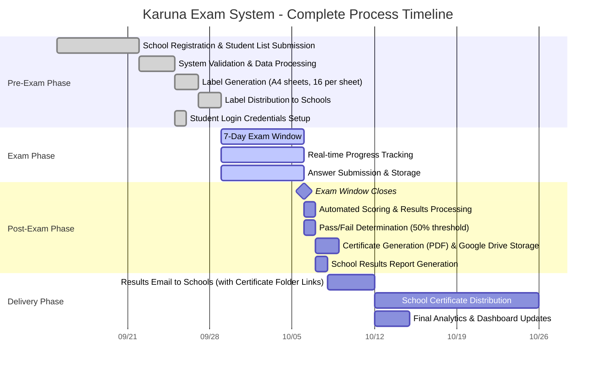
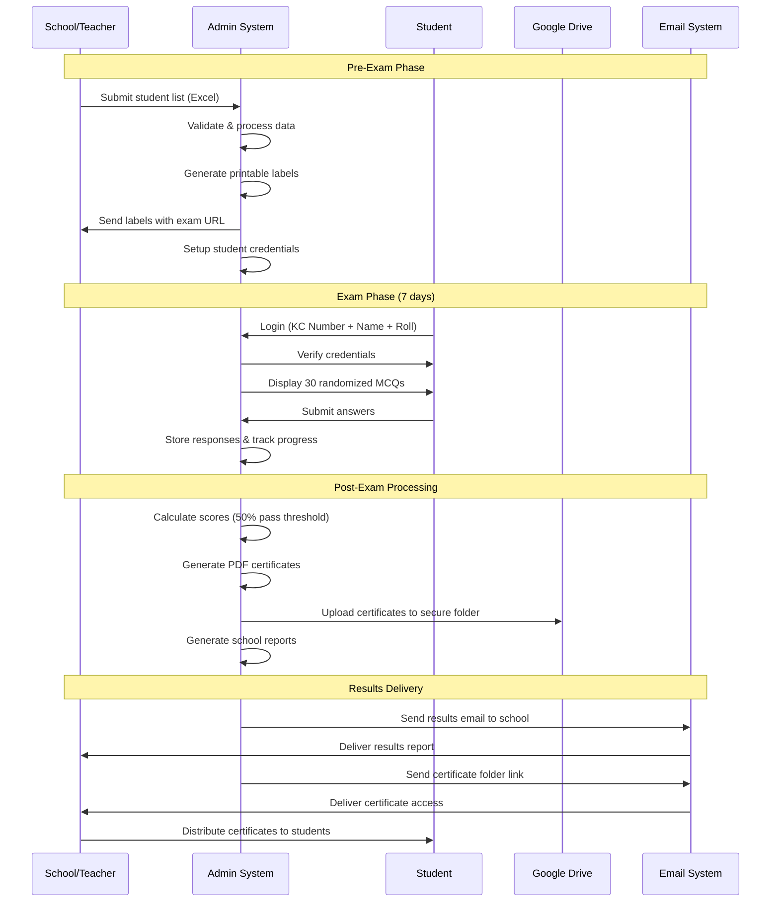
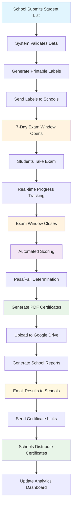

# Karuna Exam System - Complete Process Flow Timeline

## Overview
This document provides a visual timeline of the complete Karuna Exam System process, from initial registration to certificate delivery, showing all stakeholders and key milestones.

## Process Flow Timeline

## Stakeholder Interaction Flow

## Key Process Milestones

## Stakeholder Responsibilities

### Schools/Teachers
- Submit student registration list (Excel format)
- Receive and distribute exam labels to students
- Monitor student exam completion
- Receive results and certificate links
- Distribute certificates to students

### Students
- Use KC Number + Name + Roll Number to login
- Take 30 MCQ exam within 7-day window
- Receive results after 7-day exam window closes
- Receive certificate from school

### System Administrators
- Process school registration data
- Generate printable labels
- Monitor exam progress in real-time
- Process results and generate certificates
- Send reports and certificate links to schools

### Technical System
- Validate student credentials
- Deliver randomized questions
- Track exam progress
- Calculate scores automatically
- Generate PDF certificates
- Store certificates in Google Drive
- Send automated emails

## Key Performance Indicators

### Timeline Targets
- **Registration Processing**: 3 days from submission
- **Label Generation**: 2 days after validation
- **Exam Window**: 7 days (fixed)
- **Results Processing**: 1 day after exam closes
- **Certificate Generation**: 2 days after scoring
- **Results Delivery**: 1 day after processing
- **Certificate Delivery**: Same day as results (after exam window closes)

### Success Metrics
- **System Uptime**: 99.9% during exam period
- **Response Time**: < 2 seconds for exam loading
- **Concurrent Users**: Support 15,000+ students
- **Data Accuracy**: 100% accurate scoring
- **Certificate Generation**: 100% success rate
- **Email Delivery**: 100% successful delivery

## Risk Mitigation Points

### Technical Risks
- **High Traffic**: VPS/Cloud hosting with auto-scaling
- **Data Loss**: Automated backups and Google Drive storage
- **System Downtime**: 99.9% uptime guarantee with monitoring
- **Security**: Secure authentication and data encryption

### Process Risks
- **Late Registration**: Clear deadlines and automated reminders
- **Exam Issues**: Real-time monitoring and support
- **Certificate Problems**: Automated generation with manual backup
- **Communication**: Multiple notification channels

## Benefits of This Process

### For Schools
- **Faster Results**: Same-day processing vs. end of July
- **Professional Certificates**: Automated PDF generation
- **Easy Management**: Simple Excel upload process
- **Better Analytics**: Detailed performance reports

### For Students
- **Immediate Feedback**: Instant results after exam
- **User-Friendly**: Simple login and exam interface
- **Mobile Compatible**: Works on all devices
- **Secure Process**: Reliable authentication system

### For Organizers
- **Reduced Manual Work**: 90% automation
- **Better Data Management**: Centralized system
- **Scalable Solution**: Handles growth easily
- **Cost Effective**: WordPress-based solution

---

*This timeline ensures a smooth, efficient, and professional exam process that serves 15,000+ students across 50 schools with automated scoring, certificate generation, and comprehensive reporting.*
